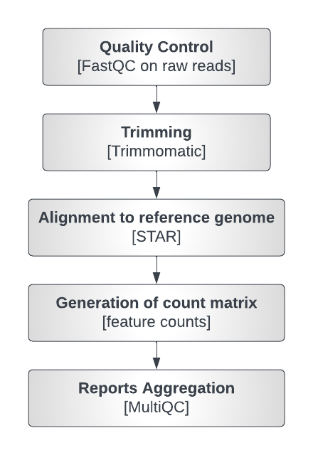

# Nextflow-RNA-Seq-Pipeline

**Automated RNA Seq Analysis Pipeline**

This pipeline automates the process of RNA-seq analysis by performing several steps such as trimming, alignment, quantification, and summarizing the results.




## Prerequisites

- Docker
- Nextflow

## Installation

1. Clone this repository:

   ```bash
   git clone https://github.com/sitakaranpatel/RNA-seq-pipeline.git
   ```

2. Build the Docker image:

   ```bash
   docker build -t rna-seq-pipeline .
   ```

   Make sure to adjust the paths and parameters in the `nextflow.config` file to match your specific pipeline and system.

## Usage

To run the pipeline, use the following command to execute the `rnaseq_script.nf` script with the options specified in the `nextflow.config` file:

```bash
nextflow run rnaseq_script.nf -c nextflow.config
```

## Output

The pipeline generates several output files, including:

- Trimmed fastq files
- FastQC reports of the trimmed reads
- Aligned BAM files
- Tab-separated gene counts
- MultiQC report

These output files are located in the directory specified in the `nextflow.config` file.

## Dependencies

The pipeline uses the following tools and libraries:

- Trimmomatic
- FastQC
- STAR aligner
- FeatureCounts
- MultiQC

All dependencies are included in the Docker image.

